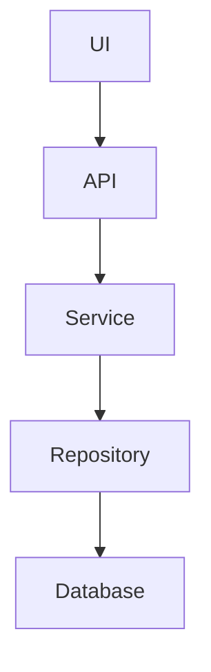
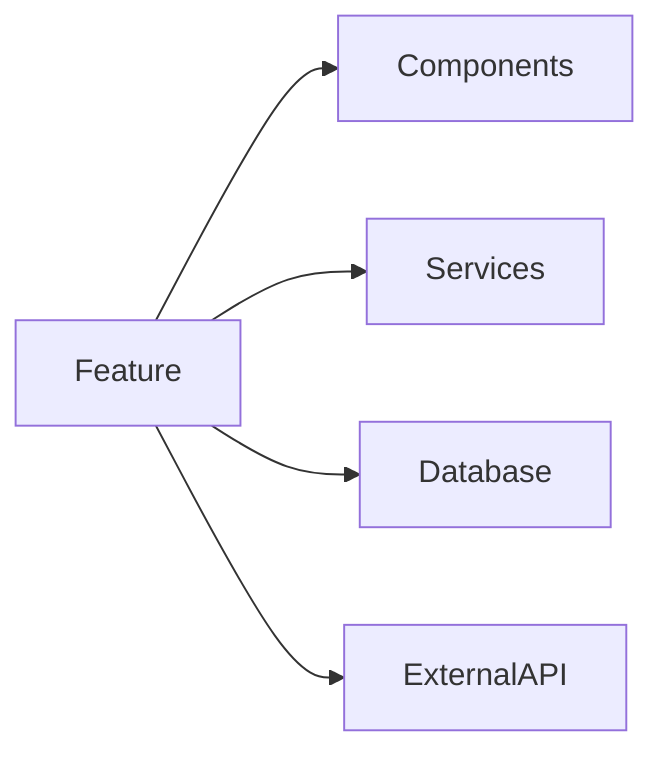

---
name: feature-tracer
description: Trace a feature end-to-end across a repository, mapping every component involved from UI to API, service, database, background jobs, external systems, tests, and side effects. Use when given a feature name, page, endpoint, component, service, database entity, bug area, or planned change and the full execution path must be understood before modifying code.
---

# Feature Tracer

## Purpose

Understand how a feature works before modifying it.

Create a complete feature map and act like a senior engineer onboarding into a large codebase.

## Core Objective

Given any of these:

- Feature Name
- Page Name
- API Endpoint
- Component
- Service
- Database Entity
- Bug Report
- User Workflow

trace everything related.

## Core Rules

- Never stop at the first match.
- Always trace the full execution path.
- Always identify upstream and downstream dependencies.
- Always include test coverage locations.
- Always identify hidden side effects.
- Separate confirmed links from inferred links.
- Prefer file references for every critical claim.

## Workflow

### Phase 1 - Entry Point Discovery

Read `references/feature-tracing-guide.md` before building a feature map.

Locate relevant:

- UI Route
- Frontend Page
- Frontend Component
- API Route
- Controller
- Service
- Repository
- Database Entity
- Queue Consumer
- Cron Job
- Webhook
- External Integration
- Tests

### Phase 2 - Request Flow Mapping

Trace the user or system flow:

```text
User Action
-> UI Component
-> State Management
-> API Call
-> Controller
-> Service
-> Repository
-> Database
-> Response
-> UI Update
```

Adapt the chain to the repository's actual architecture.

### Phase 3 - Dependency Discovery

Find:

- Shared Components
- Shared Services
- Middleware
- Validators
- Guards
- Interceptors
- Feature Flags
- Cache Layers
- Background Jobs
- External APIs
- Analytics or audit logging
- Notifications

### Phase 4 - Data Flow Analysis

Identify:

- Input Data
- Transformations
- Validation
- Business Rules
- Persistence
- Output Data

Track:

- Where data enters
- Where data changes
- Where data is stored
- Where data leaves

### Phase 5 - Feature Ownership

Identify and rank:

- Primary Files
- Secondary Files
- Dependent Files
- Critical Files
- Tests
- Configuration

### Phase 6 - Impact Analysis

If modifying the feature, determine:

- Files likely affected
- Tests likely affected
- APIs affected
- Database impact
- Deployment risk
- Backward compatibility risk
- Hidden side effects

## Mermaid Diagrams

Always create a feature flow diagram:



Always create a dependency diagram:



Replace generic node names with repository-specific names when known.

## Required Output

```markdown
# Feature Trace Report

## Feature Summary

## Entry Points

## End-to-End Flow

## Frontend Components

## Backend Components

## Database Entities

## External Integrations

## Dependency Graph

## Impact Analysis

## Critical Files

## Test Coverage Locations

## Hidden Side Effects

## Modification Risk

Low | Medium | High
```

## Risk Guidance

Low:

- One layer or one module.
- Existing tests cover the flow.
- No persistence/API/authorization change.

Medium:

- Multiple modules or layers.
- Some test coverage gaps.
- API behavior or background jobs involved.

High:

- Persistence changes.
- Auth/authorization changes.
- Payment, billing, data deletion, tenant isolation, or external side effects.
- Sparse tests.
- Unknown ownership boundaries.

## Skill-Specific References

- references/task-patterns.md - concrete trigger patterns, inputs, procedure, and pitfalls for this exact skill.
- references/verification-matrix.md - proof matrix for deciding which tests, runtime checks, or review evidence are enough.

