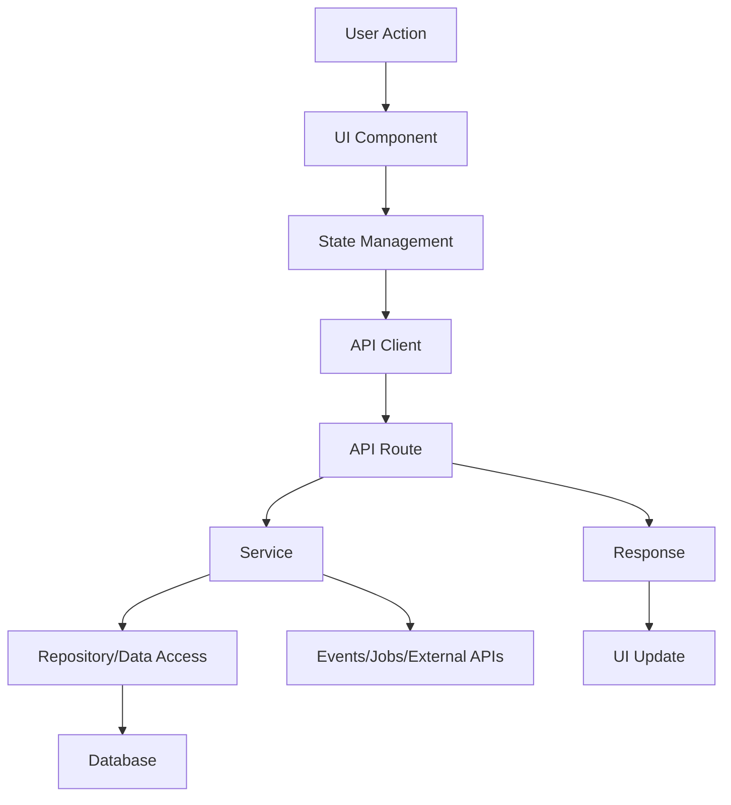
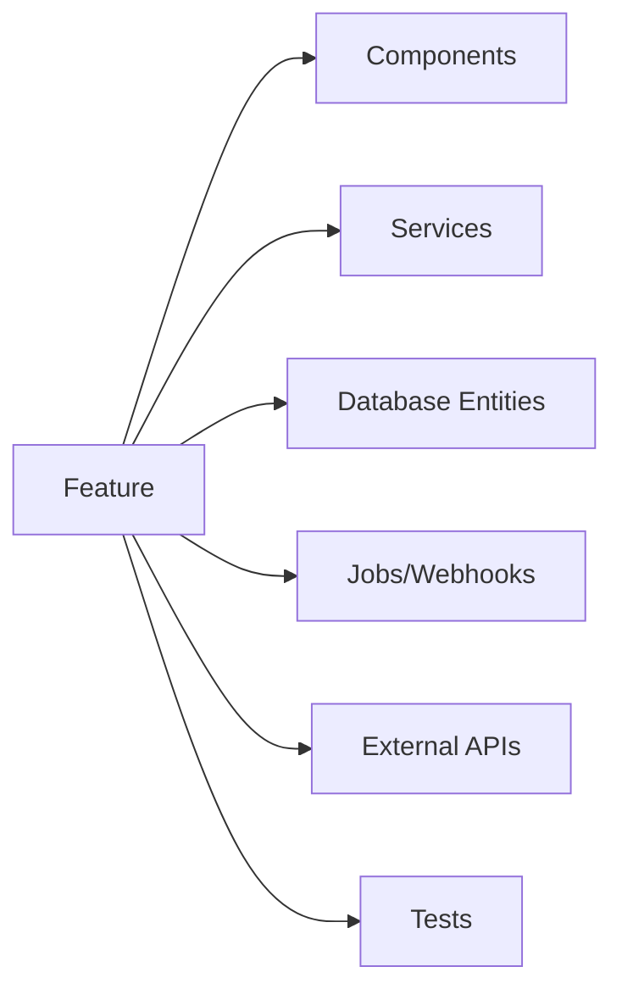

# Feature Tracing Guide

Use this guide to trace a feature across a repository.

## Starting From A Feature Name

Search for:

```bash
rg -n "feature-name|FeatureName|featureName|feature_name"
rg -n "route|path|endpoint|controller|handler|service|repository|model|schema|table"
```

Also search domain synonyms, UI labels, route slugs, API paths, table names, event names, and test names.

## Starting From A UI Page Or Component

Trace:

- Route definition
- Page component
- Child components
- State management
- Hooks
- API client calls
- Form validators
- Feature flags
- Tests

Then follow API calls into backend routes and services.

## Starting From An API Endpoint

Trace:

- Route registration
- Middleware
- Guards/policies
- Request schema
- Controller/handler
- Service/use case
- Repository/data access
- Database tables/entities
- Events/jobs/webhooks
- Response schema
- API tests

## Starting From A Database Entity

Trace:

- Model/schema definition
- Migrations
- Repositories/queries
- Services using the entity
- API endpoints exposing it
- UI screens displaying or mutating it
- Background jobs
- Tests

## File Ranking

Primary files:

- Entry points and orchestration logic directly responsible for the feature.

Secondary files:

- Helpers, validators, shared components, DTOs, schemas, and adapters used by primary files.

Dependent files:

- Tests, config, generated clients, docs, and downstream consumers.

Critical files:

- Files where a mistake can break data integrity, auth, billing, deployment, or external side effects.

## Hidden Side Effects

Look for:

- Event emission
- Queue jobs
- Webhooks
- Emails
- Push notifications
- Analytics
- Audit logs
- Cache writes/invalidations
- Feature flag checks
- Rate limits
- Retry behavior
- Scheduled jobs
- External API writes

## Mermaid Templates

Feature flow:



Dependency graph:



## Modification Risk Checklist

Raise risk when the trace includes:

- Auth or permissions
- Tenant or organization scoping
- Payments or billing
- Data deletion
- Migrations
- External writes
- Background jobs
- Cache invalidation
- Public API contracts
- Weak or missing tests
- Unclear ownership boundaries
